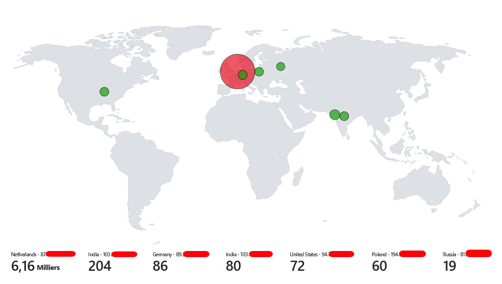

# Honeypot Windows dans Azure

## Introduction

Ce projet présente un honeypot Windows déployé dans Azure pour capturer et analyser les tentatives de connexion. L'objectif principal est d'analyser les échecs de connexion pour identifier les comptes ciblés par les attaquants et de visualiser les sources des attaques à l'aide de cartes et de tableaux générés à partir des logs.

## Objectifs du Projet

- **Surveillance des attaques** : Capturer les tentatives de connexion échouées.
- **Analyse des comptes ciblés** : Identifier les noms de comptes les plus visés.
- **Visualisation des données** : Créer des cartes et des tableaux pour représenter les sources des attaques et les comptes ciblés.
- **Remédiations simples** : Mettre en place des mesures pour réduire les tentatives d'intrusion.

## Description de l'Environnement

### Infrastructure

- **Machine Virtuelle** : VM Windows 10 déployée dans Azure.
- **Rôle de la VM** : Honeypot pour attirer les tentatives d'accès non autorisées.
- **Configuration Réseau** :
  - **Ports ouverts** : Any
  - **Network Security Group (NSG)** : Règles permissives pour permettre l'accès depuis Internet.
- **Collecte de Logs** :
  - **Microsoft Sentinel** : Utilisé comme SIEM pour l'analyse des logs.

## Collecte et Analyse des Données

### Collecte des Logs

- **Période d'observation** : Du 05/12/2024 au 06/12/2024.
- **Sources des logs** : Événements de sécurité Windows, en particulier les échecs de connexion (Event ID 4625).

### Vérification que l'Événement est une Connexion Réseau (Logon Type 3)

Pour vérifier qu'un événement d'échec de connexion (Event ID 4625) est lié à une tentative de connexion réseau, vous pouvez vérifier le **Logon Type** associé à l'événement.

- **Logon Type 3** : Représente une connexion réseau, telle qu'une tentative d'accès à un partage réseau (SMB), une authentification via HTTP, etc.

## Analyse des Échecs de Connexion Réseau

### Tableau des Comptes les Plus Ciblés

| Rang | Compte        | Nombre de Tentatives |
|------|---------------|----------------------|
| 1    | \administrator| *3120*               |
| 2    | \ADMINISTRATOR| *3060*               |
| 3    | \ADMIN        | *2490*               |
| 4    | \USER         | *470*                |
| 5    | \Administrator| *347*                |

## Création de la Carte des Attaques

- **Outil utilisé** : Microsoft Sentinel Workbooks avec intégration de cartes géographiques.
- **Méthodologie** :
    - Extraction des adresses IP sources des logs.
    - Géolocalisation des adresses IP pour obtenir les emplacements approximatifs.
    - Visualisation des données sur une carte pour représenter les origines géographiques des attaques.
 
La carte des origines géographiques des attaques n'a pas pu être entièrement remplie en raison des limites imposées par l'API utilisée pour la géolocalisation des adresses IP. 

Cela explique la différence entre les résultats visibles sur la carte et le tableau des comptes ciblés. Le tableau, en revanche, fournit une vue exhaustive des tentatives de connexion grâce à l'analyse directe des logs de sécurité sans contrainte de quotas API.

### Image de la Carte des Tentatives de Connexion Échouées (Logon Type 3)

*Description de l'image : La carte illustre les emplacements géographiques des adresses IP sources des tentatives de connexion échouées avec Logon Type 3. Les points rouges indiquent les zones avec le plus grand nombre de tentatives.*

## Remédiations Simples

### 1. Restreindre l'Accès aux Services Exposés

- **Mise à jour du NSG** :
    - Limitation de l'accès aux ports sensibles (par exemple, SMB port 445) aux adresses IP de confiance uniquement.
    - Blocage de l'accès public aux services non nécessaires.

### 2. Mettre en Place des Politiques de Mots de Passe Forts

- **Actions** :
    - Exiger des mots de passe complexes (longueur minimale, utilisation de lettres majuscules, minuscules, chiffres, symboles).
    - Mettre en place une expiration régulière des mots de passe.
    - Désactiver les comptes avec des mots de passe faibles ou par défaut.

### 3. Mettre à Jour le Système

- **Installer les Mises à Jour de Sécurité** :
    - S'assurer que le système d'exploitation et les logiciels installés sont à jour avec les derniers correctifs de sécurité.

## Conclusion

Le déploiement du Honeypot a permis de collecter des données précieuses sur les tentatives d'intrusion via des connexions réseau (**Logon Type 3**). L'analyse a révélé que les attaquants ciblent les comptes par défaut ou courants. Les remédiations mises en place ont complètement supprimé les tentatives de connexion non autorisées sur le système. (Test du 06/12/2024 au 07/12/24)
